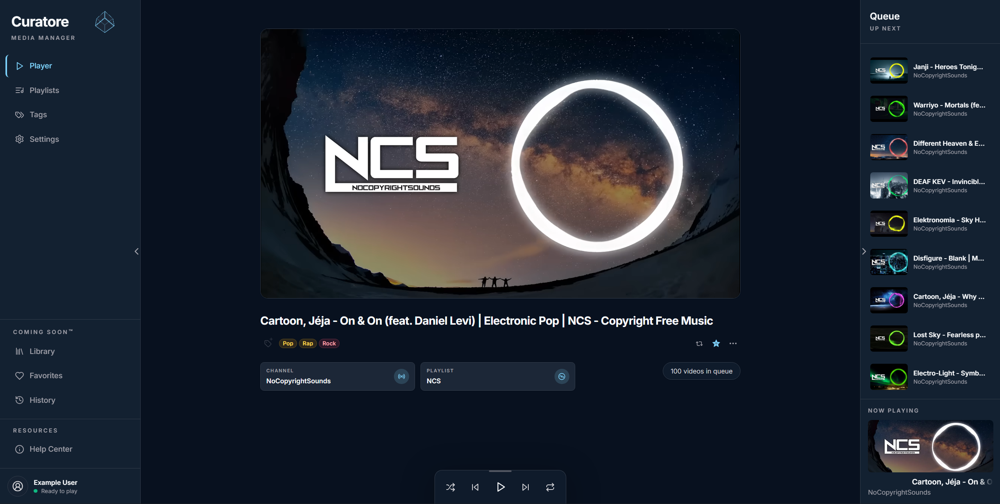
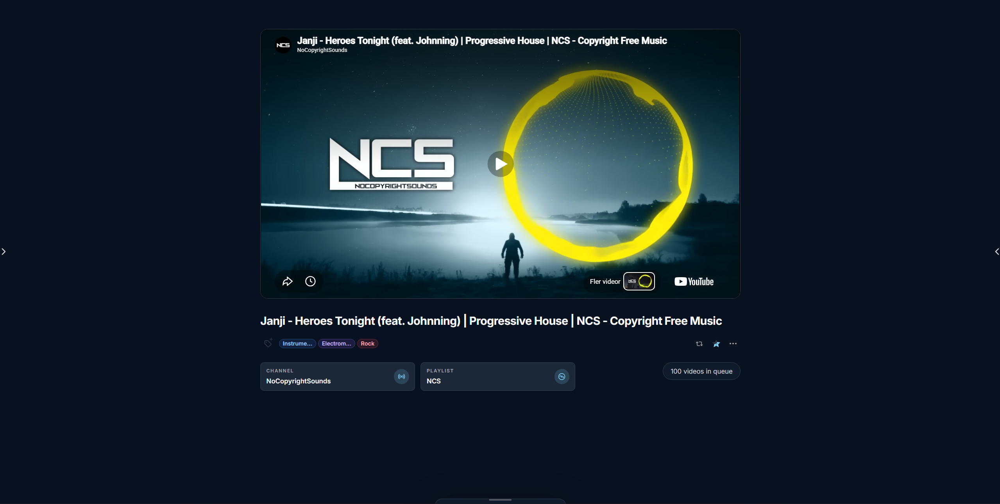
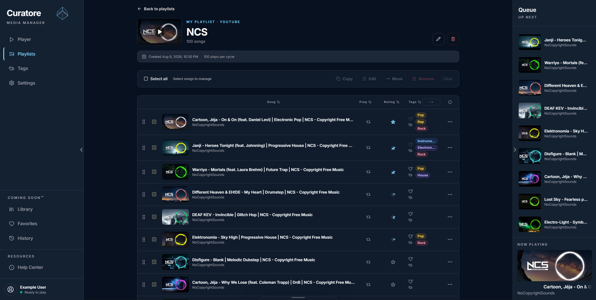
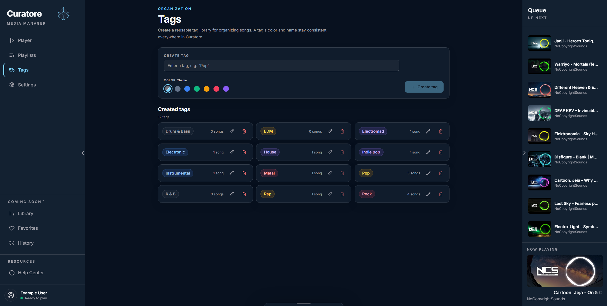
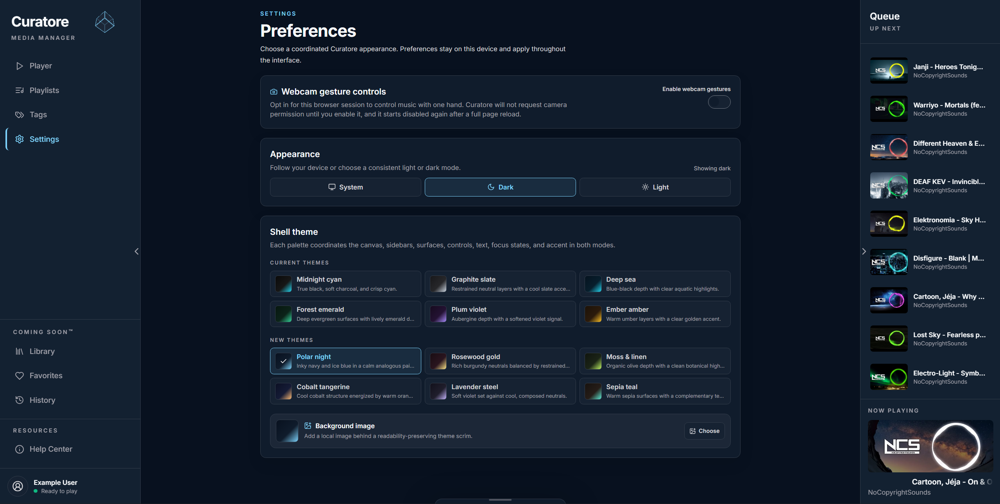
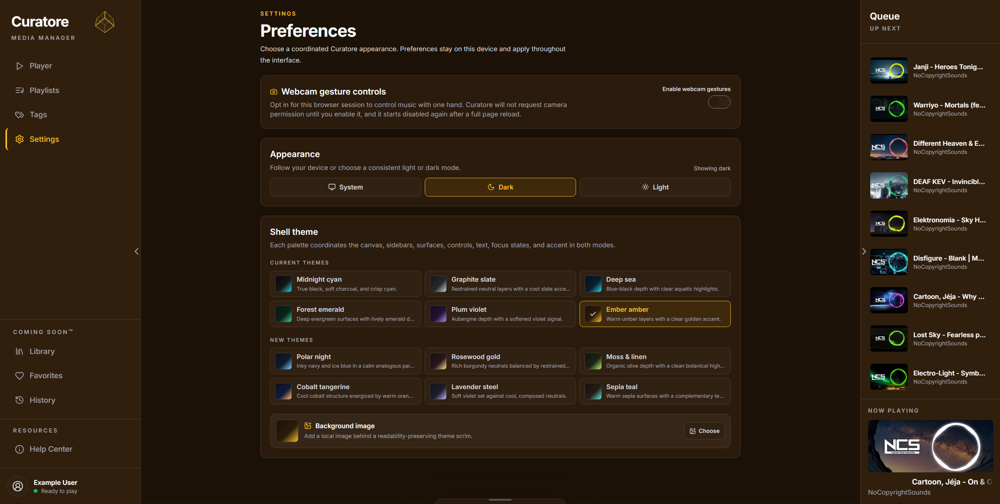

# 🎵 Curatore

A responsive YouTube playlist player and media manager for importing, curating,
and playing personal playlists across desktop and mobile.


---

## 🌍 Overview

Curatore is a personal media player built around YouTube playlists. It imports
real playlist data through the YouTube Data API, removes unavailable videos,
and presents the remaining media through a focused player and editable library.

The interface supports persistent appearance settings, an always-available
playback panel, responsive full-screen navigation and queue panels, and touch
gestures designed for mobile use.

---

## Built with Codex

Curatore is being developed entirely through collaboration with OpenAI Codex.
The project is a practical experiment in AI-assisted software development and
a way for me to strengthen how I plan, direct, evaluate, and refine work with
AI tools while continuing to develop my own technical judgment and workflow.

---

## 🚧 Status

> Active development — The player, playlist import and editing, queue, settings,
> and responsive navigation are functional. Library, Favorites, History, and
> account features are planned.

---

## ✨ Features

- **YouTube playlist import** — Import public playlists from a YouTube URL.
- **Playable-video filtering** — Exclude unavailable and non-embeddable videos.
- **Playlist editing** — Remove entries and set custom start and end times.
- **Playback controls** — Play, pause, skip, repeat, shuffle, and adjust volume.
- **Persistent queue** — Browse upcoming videos without interrupting playback.
- **Responsive navigation** — Use full-screen mobile panels and swipe gestures.
- **Fullscreen player** — Double-click or double-tap the video to enter fullscreen.
- **Personalized appearance** — Choose theme, accent, and background settings.
- **Local persistence** — Keep playlists and preferences in browser storage.

---

## 🛠️ Tech Stack

- [Next.js](https://nextjs.org/) — React framework and App Router
- [React](https://react.dev/) — Component-based user interface
- [TypeScript](https://www.typescriptlang.org/) — Static typing
- [Tailwind CSS](https://tailwindcss.com/) — Utility-first styling
- [YouTube Data API v3](https://developers.google.com/youtube/v3) — Playlist data
- [YouTube IFrame Player API](https://developers.google.com/youtube/iframe_api_reference) — Playback
- [Lucide React](https://lucide.dev/) — Interface icons

---

## 📸 Preview

### Player with navigation and queue



### Focused player



### Playlist management



### Tag management



### Polar Night theme



### Ember Amber theme



---

## 🚀 Run Locally

### Prerequisites

- A current Node.js LTS release
- pnpm 10
- A YouTube Data API v3 key

### Installation

```bash
git clone https://github.com/Zanny7/Curatore.git
cd Curatore
pnpm install
```

Copy `.env.example` to `.env.local` and add your API key:

```env
YOUTUBE_API_KEY=your_api_key
```

Start the development server:

```bash
pnpm dev
```

Open [http://localhost:3000](http://localhost:3000) in your browser.

You can create a production build with:

```bash
pnpm build
```

---

## 🙏 Credits & Disclaimer

- Playlist metadata and video availability are retrieved through the
  [YouTube Data API](https://developers.google.com/youtube/v3).
- Video playback is provided by the
  [YouTube IFrame Player API](https://developers.google.com/youtube/iframe_api_reference).
- YouTube and related names, media, and trademarks belong to their respective owners.
- Curatore is an independent project and is not affiliated with or endorsed by YouTube.

---

Built by [@Zanny7](https://github.com/Zanny7).
